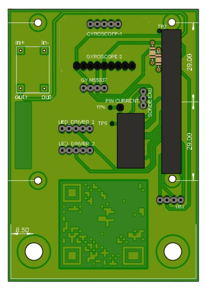

# Bluexplorer.
<p>
  Underwater Surveillance and Experimentation Vehicle Prototype.
  This project focuses on the design and development of a low-cost underwater vehicle prototype for research and monitoring purposes.
</p>
<br/>

<p align="center">
	
</p>

<br/>

⚠️This project is the result of a common work, made for school with a deadline and we chose to leave it as it was at the time of submission.

***Project date : 2025***


<br/>

# Summary

* **[Summary](#summary)**
* **[Dependencies](#dependencies)**
* **[Material list](#material-list)**
* **[Schematic](#schematic)**
* **[3D Design](#3d-design)**
* **[Getting Started](#getting-started)**
* **[The Submarine](#the-submarine)**
* **[Credits](#credits)**

# Dependencies

* [**Python**](https://www.python.org/)
### Python Libraries
* [**OpenCV**](https://opencv.org/) - Computer vision library  
* [**RPi.GPIO**](https://pypi.org/project/RPi.GPIO/) - Raspberry Pi GPIO control  
* [**ms5837**](https://github.com/bluerobotics/BlueRobotics_MS5837_Library) - Library for the MS5837 pressure sensor  
* [**lsm9ds1**](https://pypi.org/project/adafruit-circuitpython-lsm9ds1/) - IMU sensor driver  
* [**spidev**](https://pypi.org/project/spidev/) - SPI interface for Raspberry Pi

### Tools  
* [**Fusion 360**](https://www.autodesk.com/ca-fr/products/fusion-360/personal) - CAD design software  
* [**Shapr3D**](https://www.shapr3d.com/) - 3D modeling tool  
* [**VNC Viewer**](https://www.realvnc.com/fr/connect/download/viewer/) - Remote desktop access for Raspberry Pi  
* [**Pi Imager**](https://www.raspberrypi.com/software/) - OS flashing tool for Raspberry Pi
* [**PuTTY**](https://www.chiark.greenend.org.uk/~sgtatham/putty/latest.html) - SSH client
* [**Termius**](https://www.termius.com/) - SSH client for easy data transfer

<br/>

# Material list

List of materials needed for the project :
### 🔧 Main Components
| **Component**     | **Model/Ref**     | **Function**            |
|------------------ |---------------------|-------------------------|
| **Raspberry Pi**  | Raspberry Pi 4B      | Main controller         |
| **ESC 4-in-1**    | Ruibet 45A           | Motor control           |
| **Motors**        | A2212/930KV          | Propulsion              |
| **Battery**       | Li-Ion 3S2P 7000mAh  | Power supply            |
| **BMS**           | 3S 40A Balance       | Battery management      |
| **Magnetic Switch** | MC-51              | Activation system       |
| **IMU Sensor**    | LSM9DS1              | Orientation tracking    |
| **Pressure Sensor** | GY-MS5837          | Depth measurement       |
| **TDS Sensor**    | TDS Ardu             | Water quality analysis  |
| **Ethernet Cable** | Cat6 30m+            | Wired communication     |

📄 **Full BOM:** [Bill Of Materials](https://docs.google.com/spreadsheets/d/1sgO6xq_lLSSSc0nrflRu2Rw6ZhQuJfPRXvIs7I7gHWM/edit?usp=sharing)
<br/>

# Schematic
Description of the circuit schematic, created in Fusion360.

The custom PCB is designed to be mounted as a shield on the Raspberry Pi. 
It provides a more structured and reliable way to connect the main components, making assembly more convenient, although it remains optional.  

#### Components connected to the PCB:  
- **IMU Sensor** (Gyroscope)  
- **Mini 360 Input** (to power the Raspberry Pi)  
- **GPIO PWM Pins** (to control the ESC motors)  
- **TDS Sensor Pins** (Power and signal)  
- **Pressure Sensor Pins** (Power and signal)
- **MCP3008 ADC** (to read analog sensor data) 
  
<p align="center"><b>PCB bluexplorer</b></p>
<p align="center">
	
</p>

<p align="center"><b>PCB Face</b></p>
<p align="center">
	
</p>

# 3D Design

The entire 3D design was created using **Shapr3D**. 
The focus was on making the structure **compact**, ensuring all components interlock securely.
The internal structure was designed to be easily **removed in one piece** from the main tube by simply taking off the sealing joint.  

<p align="center"><b>bluexplorer cao</b></p>
<p align="center">
	
</p>

<p align="center"><b>bluexplorer cao top</b></p>
<p align="center">
	
</p>

<p align="center"><b>internal structure</b></p>
<p align="center">
	
</p>

### Sealing System  
A **custom sealing system** is used to allow cables to pass through while maintaining **optimal waterproofing**. 
Wires go through the joint, and **resin is poured** to create a tight seal while still allowing electrical connections between the inside and outside.  

<p align="center"><b>Sliced view of the 3D endcap</b></p>
<p align="center">
	
</p>

# Getting Started
### How to set up the bluexplorer submarine

## 1. Install Raspberry Pi OS  
Use **Raspberry Pi Imager** to install an OS on the Raspberry Pi.  

- Download **[Raspberry Pi Imager](https://www.raspberrypi.com/software/)**  
- Flash an image onto an SD card  
- Insert the SD card into the Raspberry Pi

---

## 2. Install Required Software  
Install the following software on your computer for communication and control:

- **[VNC Viewer](https://www.realvnc.com/en/connect/download/viewer/)**
- **[Termius](https://termius.com/)**
- **[PuTTY](https://www.chiark.greenend.org.uk/~sgtatham/putty/latest.html)**

---

## 3. Connect the Submarine via Ethernet
### **Check the Assigned IP**  
1. **Remove the SD card from the Raspberry Pi and insert it into your PC**  
2. **Open the `cmdline.txt` file** located in the `/boot/` partition  
3. Look for a parameter like:`ip=<configured_ip>`
   
If an IP is assigned, use it for the connection.
If no static IP is set, check the router’s DHCP list to find the Raspberry Pi’s address.

### Ethernet Setup on Windows  
1. **Connect the drone Ethernet cable to your PC**  
2. **Modify network settings**:  
   - Go to:  
     **Settings -> Network & Internet -> Ethernet -> Change adapter options**  
   - Select **Internet Protocol Version 4 (TCP/IPv4) -> Properties**  
   - Set:  
     ```
     IP Address: <set a compatible static IP>
     Subnet Mask: 255.255.255.0
     ```
3. **Verify connection**:  
- Open **Command Prompt** and run:  
  ```shell
  ping <Raspberry Pi IP>
  ```
- If the response is successful, the connection is established.
  
> ⚠️ **Remember to reset Ethernet settings to automatic after use to restore normal network usage.**  

---

## 4. Transfer Code to Raspberry Pi  
Download the necessary scripts:  
- [`bluecode.py`](https://github.com/MrZouu/Bluexplorer./blob/main/bluecode.py)  
- [`controller_data_transmitter.py`](https://github.com/MrZouu/Bluexplorer./blob/main/controller_data_transmitter.py)

To transfer `bluecode.py` to the Raspberry Pi, use **Termius** or another SSH client:  
```shell
scp bluecode.py pi@<Raspberry Pi IP>:/home/pi/
```
---

## 5. Enable VNC for Remote Access 
Download the necessary scripts:
1. Enable **VNC** on Raspberry Pi:
```shell
sudo raspi-config
```
Go to:  
     **Interface Options -> VNC -> Enable** 
Restart the Raspberry Pi:
```shell
sudo reboot
```
2. Connect using VNC Viewer:
    - Open VNC Viewer
    - Enter the Raspberry Pi IP address
    - Login with your credentials

---
      
## 6. Install Required Python Libraries
On the Raspberry Pi, install the necessary libraries:
```shell
  pip install opencv-python RPi.GPIO spidev ms5837 adafruit-circuitpython-lsm9ds1
```

---

## 7. Start the System
### Start the Submarine Code
Run `bluecode.py` on the Raspberry Pi:
```shell
  python3 bluecode.py
```
### Connect the Controller
  Pair the game controller via Bluetooth to yout PC
  Run the control script on your PC:
```shell
  python3 controller_data_transmitter.py
```
You should get video feedback as below, and the controls should activate the motors of the drone.

<p align="center"><b>Interface</b></p>
<p align="center">
	
</p>

#  The Submarine
Here are images of the assembled bluexplorer drone, including one with the tube detached from the frame during testing, showcasing the video feedback.

<p align="center"><b>bluexplorer</b></p>
<p align="center">
	
</p>

<p align="center"><b>bluexplorer setup</b></p>
<p align="center">
	
</p>

#  Credits
* [**Lorenzo M**](https://github.com/MrZouu) : Co-creator of the project.
* [**Mathéo P**](https://github.com/sc0pziion) : Co-creator of the project.
* [**Corentin Hu**](https://github.com/cohru) : Co-creator of the project.
* [**Clement Auray**](https://github.com/Clementauray) : Co-creator of the project.
* [**Evann Ali-Yahia**](https://github.com/EvannAyh) : Co-creator of the project.
* [**Emma Vidilla**](http://github.com/emma-ryck) : Co-creator of the project.
* **Rémi Gilbaut** : Co-creator of the project.
